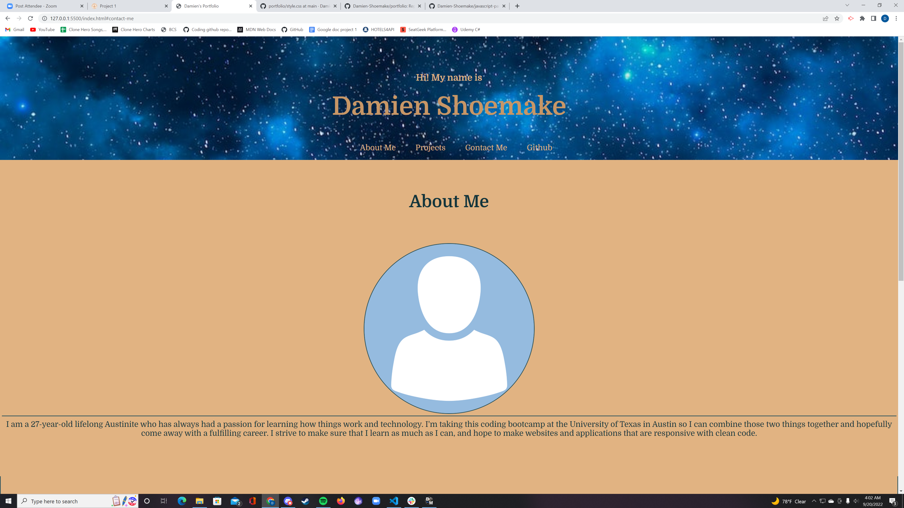

# Portfolio Website

## The homework for week 2 of class is to create a portfolio

 

## Functionality

 

- Utilize html and vanilla CSS to create a portfolio that will contain all of the work we do in the coding bootcamp

- Utilize media queries to make a responsive portfolio

 

## The Code

 

## This portfolio contains: 

- Placeholder images for an avatar
- A small "About Me" section to familiarize potential employers with me. 
- A contact section to let employers communicate with me
- A navigation menu at the top of the page to jump around the page itself
- A list of projects that have been completed during class
- A mock contact section with no js functionality

## Screenshot of the Application

## Live URL of the Application

https://damien-shoemake.github.io/portfolio/
